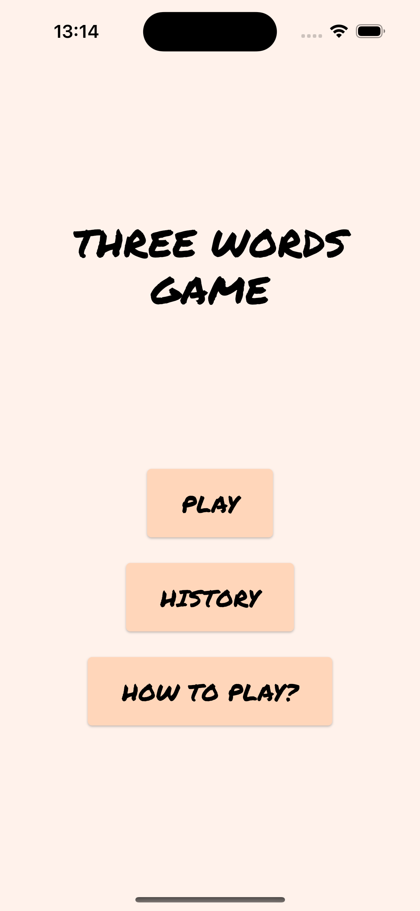
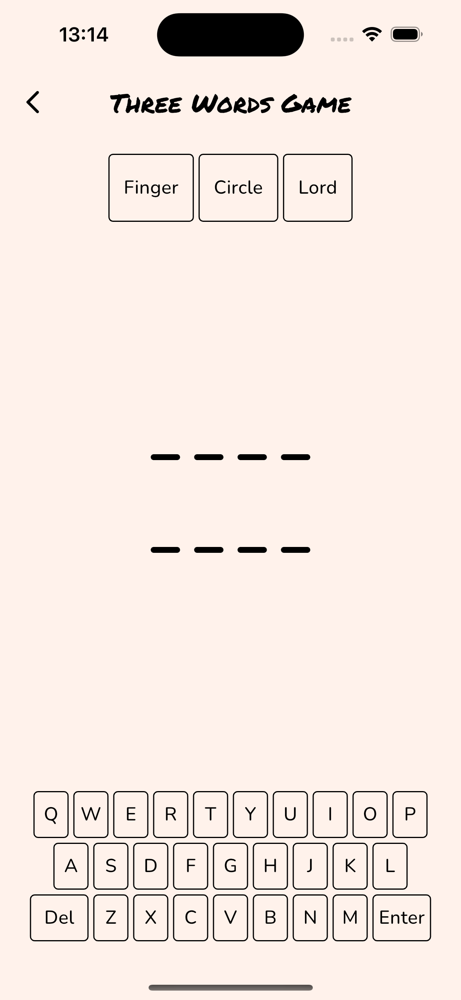
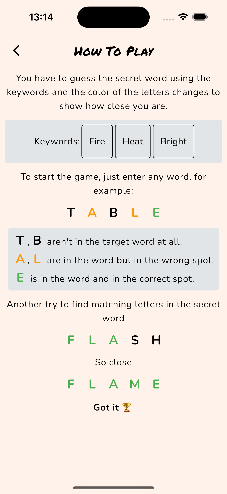

# Three Words Game

Mobile word game built with Flutter. Players try to find the secret word using keywords.

## Tech stack

- Flutter & Dart
- Sqflite (local database, store words and player's progress)
- Riverpod (state management and dependency injection)
- Firebase Crashlytics (error monitoring)

## Screenshots
<br>




<br>
[!Winner Screen Video](https://www.youtube.com/shorts/f-VAtmdAypg)

## DB tables

### Words

| id: int | word: String | keywords: String | isCompleted: int |

### Histories

| id: int | wordId: int | attempts: String |

## Developer's note

It was fun to build this game, especially the game logic. I implemented features in accordance with clean architecture but sometimes I got bored. Because there are many abstraction layers in this architecture. Sometimes it's useful but we often write code thinking about the future, but that future never comes.

## How to install?

Clone the repo
```
git clone https://github.com/burakiscoding/flutter_chat_app.git
```
Move into project directory
```
cd four_words_game
```
Get dependencies
```
flutter pub get
```
Run
```
flutter run
```


## What could I have done better?

- I could create word decks/groups instead of having one table for all the words. This way, adding new words would be easier.
- I could create a pdf file or a website to show words and answers. I think it would be useful for the players who need help.
- I could use a different error handling method. I used [Result] type but I could use Golang style error handling. Like this:
```
if err != nil {

}
```

## File structure
```
lib
├── core
│   ├── db
│   ├── error
│   ├── extensions
│   ├── models
│   ├── theme
│   └── ui
├── features
│   ├── game
│   │   ├── data
│   │   │   ├── datasources
│   │   │   ├── models
│   │   │   └── repositories
│   │   ├── domain
│   │   │   ├── entities
│   │   │   ├── repositories
│   │   │   └── usecases
│   │   └── presentation
│   │       ├── helpers
│   │       ├── models
│   │       ├── state
│   │       └── ui
│   ├── history
│   ├── how_to_play
│   └── menu
├── firebase_options.dart
└── main.dart
```